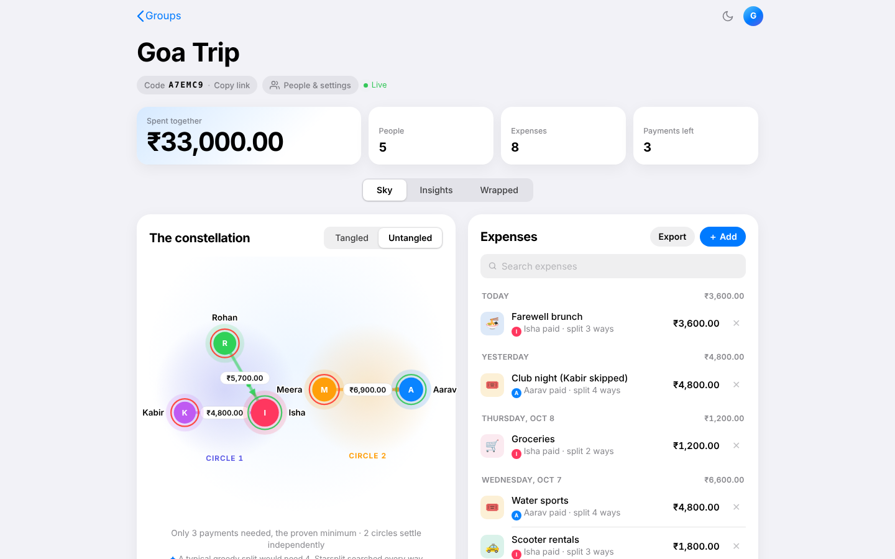
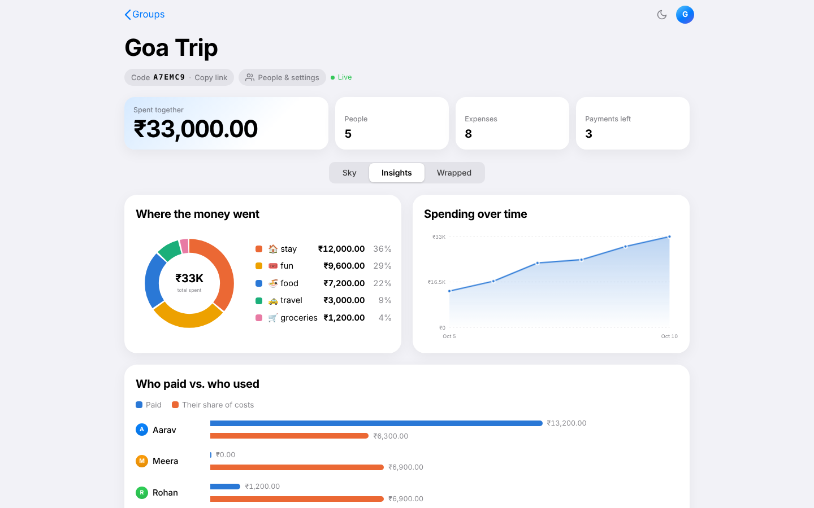

# ✦ Starsplit

Split expenses with friends, and watch the tangled web of IOUs **untangle into a constellation**.

Most expense splitters show you a list of numbers. Starsplit turns each group into a night sky: every person is a star, every debt is a glowing line flowing from debtor to creditor. Flip the **Tangled ↔ Untangled** toggle and the raw who-owes-who web collapses into the minimum number of payments that settles everyone.





## Features

- **iOS/macOS-inspired design**: system typography, automatic light/dark mode (plus a manual toggle), translucent nav bar with a collapsing large title, sliding segmented controls, iOS-style switches, a bottom-sheet editor, and spring animations. Uses the View Transitions API where supported and honours `prefers-reduced-motion`.
- **Manage people**: rename the group, add, rename or remove people (removal is blocked while someone is part of an expense).
- **Undo** for deleted expenses and payments, a searchable ledger grouped by day, and an installable web app (manifest + icon).
- Create a group ("constellation") with a shareable 6-character code. No sign-up needed.
- **Four ways to split**: equally, exact amounts, percentages, or shares (e.g. 2 nights vs 1 night), with live per-person previews. Edit any expense afterwards.
- **Interactive constellation**: drag the stars around; comets flow along each debt; star size and glow reflect balance. Layout is remembered per group.
- **Tangled ↔ Untangled** toggle: raw who-owes-who vs. the minimum set of payments (min-cash-flow).
- **Insights**: spending by category (donut), cumulative spending over time (hover crosshair), and paid-vs-used per person.
- **Wrapped**: Spotify-style awards for the trip (The Backbone, Biggest Appetite, Priciest Moment…).
- **Live sync**: open the same code on two devices and changes appear instantly (server-sent events).
- One-click "Mark paid" settlements with a celebration when everyone is square, CSV export, and a copy-paste settle-up message for the group chat.
- "Try a demo trip" button, deep links (`#/g/CODE/insights`), responsive, respects `prefers-reduced-motion`.

## Tech stack

| Layer    | Choice |
|----------|--------|
| Backend  | Node.js + Express (REST JSON API) |
| Database | SQLite via Node's built-in `node:sqlite` (zero native deps) |
| Frontend | Vanilla JS, hash routing, hand-written SVG and CSS (no build step) |
| Realtime | Server-sent events (`EventSource`), no WebSocket library needed |
| Tests    | `node:test` (unit tests for money logic + API integration tests) |

## Run it

Requires **Node 22.13+**.

```bash
npm install
npm start        # http://localhost:3000
npm test
```

## How it works

- **Money is stored as integer cents** so there is no floating-point drift. Every split mode goes through one largest-remainder allocator, so shares always sum exactly to the total ([balance.js](balance.js)).
- **Charts are hand-written SVG.** Category colours come from a palette checked for colour-blind separation and contrast on the dark background; every chart has hover tooltips and its numbers are also shown as text.
- **Balance** = what you paid − your share of everything. Balances always sum to zero.
- **Tangled view**: direct pairwise debts, netted per pair.
- **Untangled view**: greedy min-cash-flow. Match the biggest debtor with the biggest creditor until everyone is at zero, giving at most *n − 1* payments.
- **Settling up** is stored as a `payment` entry, so balances stay derived from one source of truth (the ledger) and deleting an entry just works.
- Multi-step writes (expense + its splits) run in a SQL transaction; the server validates all input and returns clear 4xx errors.

## API

| Method | Route | Purpose |
|--------|-------|---------|
| POST   | `/api/groups` | Create group `{name, currency, members[]}` → `{code}` |
| GET    | `/api/groups/:code` | Members, ledger, balances, raw and simplified debts |
| PATCH  | `/api/groups/:code` | Rename group `{name}` |
| POST   | `/api/groups/:code/members` | Add a person |
| PATCH  | `/api/groups/:code/members/:id` | Rename a person |
| DELETE | `/api/groups/:code/members/:id` | Remove a person (only if not in any expense) |
| POST   | `/api/groups/:code/expenses` | Add expense `{description, amount, paidBy, category, date, splitType, split}` |
| PUT    | `/api/groups/:code/expenses/:id` | Edit an expense (same body) |
| GET    | `/api/groups/:code/events` | Server-sent events stream for live updates |
| POST   | `/api/groups/:code/settle` | Record payment `{from, to, amount}` |
| DELETE | `/api/groups/:code/expenses/:id` | Remove an entry |

## Deploy

The app is a single Node process with a SQLite file, so any host that runs Node works.

- **Render**: `render.yaml` is included (free plan, health check at `/healthz`). Note that the free plan has an ephemeral disk, so data resets on redeploy; attach a persistent disk and set `DB_FILE=/var/data/starsplit.db` to keep it.
- **Docker**: `docker build -t starsplit . && docker run -p 3000:3000 -v starsplit-data:/data starsplit`

Production notes: per-IP rate limiting on writes, security headers, `trust proxy` for correct client IPs, and SSE responses are unbuffered so live sync works behind proxies.

## Project layout

```
src/
  server.js      Entry point (listen, graceful shutdown)
  app.js         Express setup: headers, static files, error handling
  routes.js      REST routes for groups, members and the ledger
  store.js       Prepared SQL queries + derived group state
  validate.js    Input cleaning and expense parsing
  balance.js     Pure money logic (split, balances, simplify)
  live.js        Server-sent events rooms
  db.js          SQLite schema + transaction helper
public/
  index.html     Shell
  css/           tokens, base, components, home, group, charts, sheet, responsive
  js/            ES modules: main (router), home, group, sky, constellation,
                 insights, wrapped, expense-sheet, people-sheet, actions, ui, util
test/            balance.test.js, api.test.js
```

## Ideas for next steps

Multi-currency groups, receipt photos, optional accounts, offline queueing of edits.
